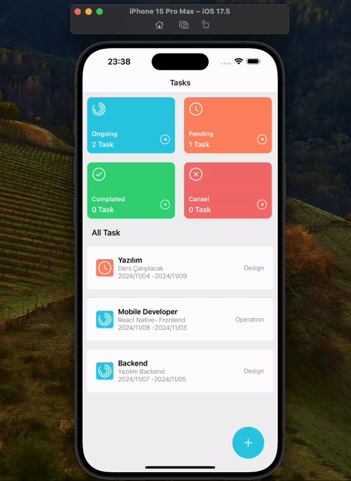

# Task Management App

The Task Management App is a mobile application that allows users to track their tasks. Users can create, update, delete tasks, and change the status of tasks (Ongoing, Pending, Completed, Canceled). Additionally, tasks can be categorized, and start and end dates can be specified for each task.

## Project Objective

The objective of this project is to develop a task management app using React Native. With a user-friendly interface, users can easily manage their tasks and track their statuses. The app aims to provide a practical platform where users can quickly add and update their tasks.

## Project Features

- Users can view saved tasks as a list.
- Four main statuses (Ongoing, Pending, Completed, Canceled) can be selected for each task.
- Tasks can be categorized into "Software", "Design", "Operation", etc.
- Tasks are stored on the device using AsyncStorage.
- Tasks can be updated with the _pull-to-refresh_ functionality.
- Details such as title, description, start date, and end date can be viewed for each task.
- Task statuses can be quickly changed using buttons like "Start", "Completed", and "Cancel".

## Technologies Used

- React Native
- AsyncStorage
- Formik
- Yup
- Moment. js
- UI Kitten
- Iconsax React Native

## Libraries

- npm install @react-navigation/native
- npm install react-native-screens
- react-native-safe-area-context
- npm install @react-navigation/native-stack
- npm install formik --save
- npm install yup --save
- npm i @ui-kitten/components @eva-design/eva react-native-svg
- npm i iconsax-react-native react-native-svg

## ScreenShot

